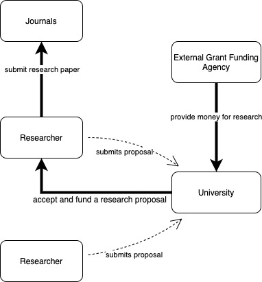
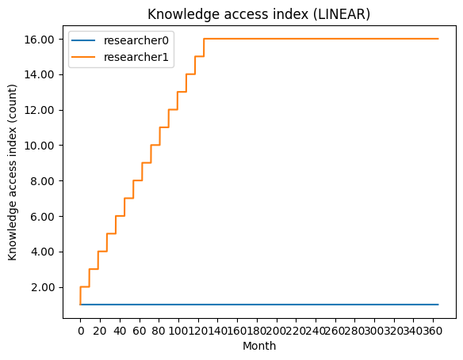
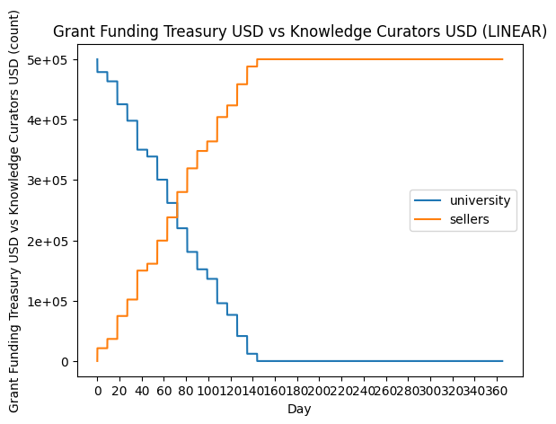

# Model #1 Baseline

This model is based on the current status quo of scientific funding and value flow. It consists of researchers competing for funding from an exhaustible funding agency via research proposals. The research grant is then spent on 1. research costs (e.g. equipment, data, etc.) and 2. getting the research published in a journal.

In this model, the knowledge curators (journals) lock most of the value from the research and they have full control over who gets access to the knowledge assets that have been published. This in turn means that researchers who have been given a grant in the past have a much higher chance of receiving grants in the future and while this itself has multiple parameters (e.g. expertise in the field, the ability to produce high quality proposals, reputation, etc.), it is modelled by a single variable in the simulation called `knowledge_access`.

*A schema of the baseline model (current scientific research pipeline)*

Apart from knowledge curators locking value, there is a significant loss in value and time due to a lack of incentive to share research data and collaborate (note that research papers don't usually include all the data that has been collected). As a result, if the same dataset is useful for two independent research projects, it would have to be collected twice since researchers don't have incentive to share their work with each other and they also have limited access to other people's research via knowledge curators.

The plots above show how this model leads to a winner-takes-all system where the first researcher to win a grant gets a significant competitive advantage over everyone else. Also, since the university (or any other grant funding agency) is separate from the knowledge curators, no value is flowing back, therefore it is only able to fund a limited number of research projects depending on the available funding.

Additional plots from other simulations:

Baseline Grant Funding Model: Value Flow

Baseline Grant Funding Model: Number of Research Proposals Funded