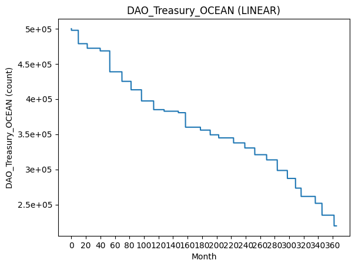
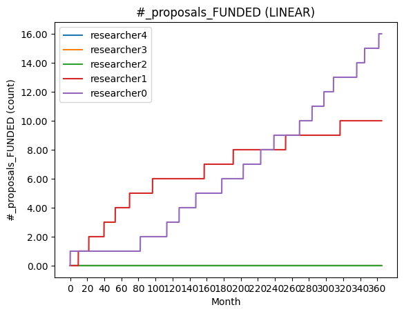
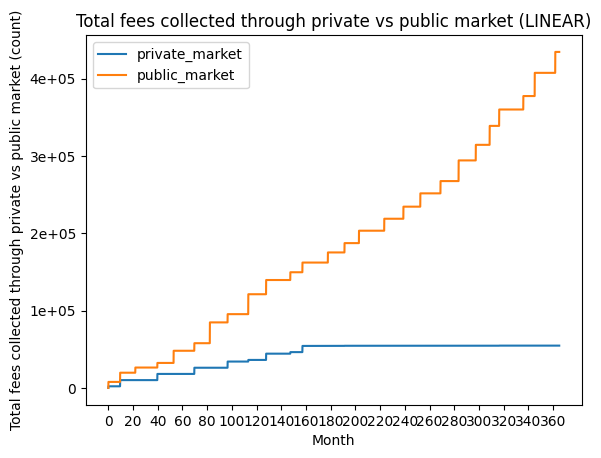

# Model #3 Public Funding

Moving on from the simple web3 profit sharing model, I now introduce the public funding model. This model takes what works from the profit sharing model, but applies it to a open science ecosystem in which funding is only contributed towards public research, i.e. research projects that don't belong to any individual but are available for the entire community to use. Note that this does not mean the knowledge assets produced by these research projects are free (they are quite cheap though), it only means the assets are owned by the community, therefore whenever somebody buys access to public data, all of the tokens spent will go to the DAO Treasury (in future variations of this model, the tokens might be distributed across multiple stakeholders within the ecosystem).

Schema of the public/private open science model

In this model, knowledge assets are split into three categories: data, algorithms, compute services, and each researcher is assigned one of these asset categories to produce. These new researchers are referred to as Data Providers, Algorithm Providers, and Compute Providers, respectively. In addition to setting the output knowledge asset of the specific researchers, these types also determine the assets that a researcher might need to buy. For instance, an Algorithm Provider could be a theorist trying to find a new pattern in other people's data, so they would make use of the knowledge market to buy the data they need. On the other hand, a Data Provider might either collect new data themselves or they might transform their existing data with an algorithm from the marketplace. Lastly, the Compute Provider can be thought of as a private research organization that has collected a very large dataset (so large it would not be efficient to store on IPFS), so it allows other people to run computations on their data as a cloud service.

This model has a number of fixed parameters, such as the number of researchers, the prices of specific knowledge assets in the marketplaces (public marketplace is cheaper than private, compute services are more expensive than access to data or algorithms) and the costs of publishing (publishing to the private market is more expensive than to the public one. 

This model has so far been the most effective in terms of longevity, since after 30 years, the treasury is still not depleted, however, it has some limitations that will be improved in newer versions:

- private agents publish/buy assets until they run out of funds, which is not realistic
- there is a fixed number of researchers, but in reality we should expect a growth of the community
- we are not tracking most of the high resolution metrics that this model includes (like the performance of different types of researchers)